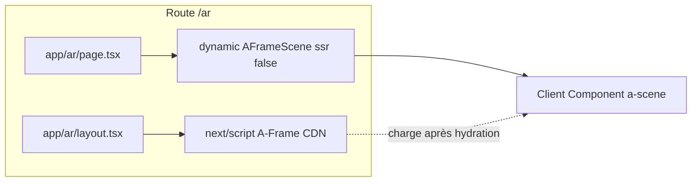

# Intégration d'A-Frame dans Next.js (Lootopia)

## Contexte

[A-Frame](https://aframe.io/) est un framework web pour créer des expériences 3D/AR/VR avec du HTML déclaratif (entités `<a-scene>`, `<a-box>`, etc.). Il repose sur WebGL et des APIs navigateur (WebXR), donc **il ne doit s’exécuter que côté client**. Le projet utilise Next.js 16 (App Router) et React 19.

## Recommandation : CDN + composant Client (sans aframe-react)

**Approche retenue :** charger A-Frame via CDN avec `next/script`, et rendre la scène dans un **Client Component** importé en **dynamic avec `ssr: false**`.

- **Pourquoi pas aframe-react :** le package [aframe-react](https://www.npmjs.com/package/aframe-react) n’est plus maintenu (dernière publication il y a plusieurs années) et peut poser des problèmes avec React 19 (refs, rendu). A-Frame en HTML déclaratif dans un composant Client reste la option la plus fiable.
- **CDN vs npm :** le script officiel `https://aframe.io/releases/1.4.x/aframe.min.js` (ou 1.7.x) évite les soucis de bundling (Webpack/Next avec Three.js/A-Frame). On peut le charger uniquement sur `/ar` pour ne pas impacter les autres pages.

## Architecture

- `**app/ar/layout.tsx**` : layout propre à `/ar` qui inclut `next/script` pour le CDN A-Frame (stratégie `afterInteractive` ou `lazyOnload`).
- `**app/ar/page.tsx**` : reste un Server Component ; il rend un composant dynamique qui importe la scène.
- **Composant scène** (ex. `components/aframe/AFrameScene.tsx`) : marqué `'use client'`, contient `<a-scene>` et le contenu A-Frame (primitives, etc.). Ce composant est importé via `next/dynamic` avec `{ ssr: false }` pour éviter tout rendu serveur (WebGL indisponible).

## Fichiers à créer ou modifier

| Fichier                                | Action                                                                                                                                                                                            |
| -------------------------------------- | ------------------------------------------------------------------------------------------------------------------------------------------------------------------------------------------------- |
| [app/ar/layout.tsx](app/ar/layout.tsx) | **Créer** : layout avec `Script` pointant vers le CDN A-Frame (ex. `https://aframe.io/releases/1.4.2/aframe.min.js`).                                                                             |
| [app/ar/page.tsx](app/ar/page.tsx)     | **Modifier** : utiliser `dynamic()` pour importer le composant scène avec `ssr: false`, et éventuellement un fallback (message ou loader) pendant le chargement.                                  |
| `components/aframe/AFrameScene.tsx`    | **Créer** : Client Component qui rend `<a-scene>` et des primitives (ex. `<a-box>`, `<a-sky>`, caméra) pour valider l’intégration.                                                                |
| `types/aframe.d.ts`                    | **Créer** : déclarations TypeScript pour étendre `JSX.IntrinsicElements` avec les éléments A-Frame (`a-scene`, `a-box`, `a-entity`, etc.) afin d’éviter les erreurs TS sur les balises inconnues. |

## Détails techniques

1. **Script A-Frame**
   Dans `app/ar/layout.tsx`, utiliser par exemple :

- `strategy="afterInteractive"` pour charger après l’hydratation (recommandé pour une page dédiée AR).
- URL : `https://aframe.io/releases/1.4.2/aframe.min.js` (ou 1.7.x selon la doc officielle).

1. **Dynamic import**
   Dans `app/ar/page.tsx` :

- `const AFrameScene = dynamic(() => import('@/components/aframe/AFrameScene'), { ssr: false });`
- Rendre `<AFrameScene />` (et optionnellement un état de chargement).

1. **Client Component**
   Dans `AFrameScene.tsx` :

- `'use client'` en première ligne.
- Retourner du JSX avec les éléments A-Frame en minuscules (ex. `<a-scene>`, `<a-box position="0 1 -3" color="blue">`, `<a-sky>`, etc.). React passera ces noms de balises au DOM tel quel.

1. **TypeScript**
   Dans `types/aframe.d.ts`, étendre l’interface des éléments intrinsèques pour inclure au minimum `a-scene`, `a-box`, `a-entity`, `a-sky`, `a-camera`, etc., avec des props génériques (`React.DetailedHTMLProps<React.HTMLAttributes<HTMLElement> & { ... }, HTMLElement>`) ou un type `Record<string, unknown>` pour les attributs A-Frame.

## Résumé des choix

- **Pas de dépendance npm** pour A-Frame : chargement CDN uniquement sur la route `/ar`.
- **Rendu côté client uniquement** pour la scène : `dynamic` + `ssr: false` + `'use client'`.
- **Types TypeScript** : fichier de déclaration dédié pour une bonne DX sans `@ts-ignore`.

Après implémentation, ouvrir `/ar` dans le navigateur doit afficher une scène A-Frame (ex. boîte 3D + ciel), avec possibilité d’ajouter plus tard AR.js ou d’autres composants A-Frame selon le cahier des charges.
