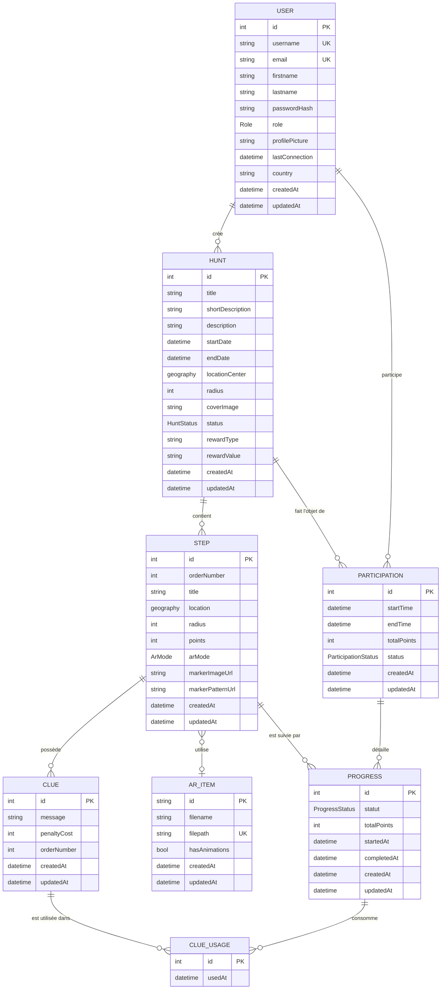

# Lootopia — MCD / MLD / MPD

Documentation des modèles de données dérivée des schémas Prisma (`apps/api/src/orm/prisma/schemas/`).

Entités identifiées : `User`, `Hunt`, `Step`, `Clue`, `ClueUsage`, `Participation`, `Progress`, `ArItem`.
Énumérations : `Role`, `HuntStatus`, `ArMode`, `ParticipationStatus`, `ProgressStatus`.

---

## 1. MCD — Modèle Conceptuel de Données (Merise)

### Diagramme



### Associations et cardinalités (Merise)

| Association | Entités | Cardinalités |
|---|---|---|
| **CRÉER** | User – Hunt | (0,n) – (1,1) |
| **PARTICIPER** | User – Hunt | (0,n) – (0,n), porteur via `Participation` (contrainte d'unicité user+hunt) |
| **COMPOSER** | Hunt – Step | (1,n) – (1,1) |
| **CONTENIR** | Step – Clue | (0,n) – (1,1) |
| **UTILISER_AR** | Step – ArItem | (0,n) – (0,1) |
| **SUIVRE** | Participation – Step | (1,n) – (0,n), porté par `Progress` (unicité participation+step) |
| **CONSOMMER** | Progress – Clue | (0,n) – (0,n), porté par `ClueUsage` (unicité progress+clue) |

### Règles de gestion

- Un `User` joue un rôle parmi `ADMIN`, `PARTNER`, `PLAYER`.
- Un `Hunt` a un statut `DRAFT` / `ACTIVE` / `FINISHED` et est créé par un seul user (le partenaire).
- Une `Step` est ordonnée (`orderNumber` unique par `Hunt`) et fonctionne en mode `GPS` ou `MARKER`.
- Une `Clue` est ordonnée (`orderNumber` unique par `Step`) et a un coût de pénalité.
- Une `Participation` est unique par couple (user, hunt) ; statut `IN_PROGRESS` / `COMPLETED` / `ABANDONED`.
- Un `Progress` est unique par couple (participation, step) ; statut `IN_PROGRESS` / `COMPLETED` / `SKIPPED`.
- Un `ClueUsage` est unique par couple (progress, clue) — un indice ne peut être consommé qu'une fois par tentative d'étape.

---

## 2. MLD — Modèle Logique de Données

Notation : `Table (clé_primaire, attributs, #clé_étrangère)`.

```
User (
    id [PK],
    username [UNIQUE],
    firstname,
    lastname,
    email [UNIQUE],
    passwordHash,
    role,
    profilePicture,
    lastConnection,
    country,
    createdAt,
    updatedAt
)

ArItem (
    id [PK],
    filename,
    filepath [UNIQUE],
    hasAnimations,
    createdAt,
    updatedAt
)

Hunt (
    id [PK],
    title,
    shortDescription,
    description,
    startDate,
    endDate,
    locationCenter,
    radius,
    coverImage,
    status,
    rewardType,
    rewardValue,
    createdAt,
    updatedAt,
    #refUser → User(id)
)

Step (
    id [PK],
    orderNumber,
    title,
    location,
    radius,
    points,
    arMode,
    markerImageUrl,
    markerPatternUrl,
    createdAt,
    updatedAt,
    #refHunt → Hunt(id),
    #refArItem → ArItem(id),
    UNIQUE(refHunt, orderNumber)
)

Clue (
    id [PK],
    message,
    penaltyCost,
    orderNumber,
    createdAt,
    updatedAt,
    #refStep → Step(id),
    UNIQUE(refStep, orderNumber)
)

Participation (
    id [PK],
    startTime,
    endTime,
    totalPoints,
    status,
    createdAt,
    updatedAt,
    #refUser → User(id),
    #refHunt → Hunt(id),
    UNIQUE(refUser, refHunt)
)

Progress (
    id [PK],
    statut,
    totalPoints,
    startedAt,
    completedAt,
    createdAt,
    updatedAt,
    #refParticipation → Participation(id),
    #refStep → Step(id),
    UNIQUE(refParticipation, refStep)
)

ClueUsage (
    id [PK],
    usedAt,
    #refProgress → Progress(id),
    #refClue → Clue(id),
    UNIQUE(refProgress, refClue)
)
```

**Transformations MCD → MLD appliquées :**

- Les associations (1,1)–(0,n) ont été matérialisées par une clé étrangère côté entité « 1,1 ».
- Les associations N:N porteuses d'attributs ou d'identifiants (`PARTICIPER`, `SUIVRE`, `CONSOMMER`) ont été transformées en tables associatives (`Participation`, `Progress`, `ClueUsage`) avec contraintes d'unicité composite.
- Les énumérations Prisma deviendront des types `ENUM` PostgreSQL côté MPD.

---

## 3. MPD — Modèle Physique de Données (PostgreSQL + PostGIS)

```sql
-- Extensions
CREATE EXTENSION IF NOT EXISTS postgis;

-- Types ENUM
CREATE TYPE "Role"                AS ENUM ('ADMIN', 'PARTNER', 'PLAYER');
CREATE TYPE "HuntStatus"          AS ENUM ('DRAFT', 'ACTIVE', 'FINISHED');
CREATE TYPE "ArMode"              AS ENUM ('GPS', 'MARKER');
CREATE TYPE "ParticipationStatus" AS ENUM ('IN_PROGRESS', 'COMPLETED', 'ABANDONED');
CREATE TYPE "ProgressStatus"      AS ENUM ('IN_PROGRESS', 'COMPLETED', 'SKIPPED');

-- =====================
-- Table User
-- =====================
CREATE TABLE "User" (
    id              SERIAL       PRIMARY KEY,
    username        TEXT         NOT NULL UNIQUE,
    firstname       TEXT         NOT NULL,
    lastname        TEXT         NOT NULL,
    email           TEXT         NOT NULL UNIQUE,
    "passwordHash"  VARCHAR(60)  NOT NULL,
    role            "Role"       NOT NULL DEFAULT 'PLAYER',
    "profilePicture" TEXT,
    "lastConnection" TIMESTAMP(3),
    country         TEXT         NOT NULL,
    "createdAt"     TIMESTAMP(3) NOT NULL DEFAULT CURRENT_TIMESTAMP,
    "updatedAt"     TIMESTAMP(3) NOT NULL
);

-- =====================
-- Table ArItem
-- =====================
CREATE TABLE "ArItem" (
    id              TEXT         PRIMARY KEY,           -- UUID
    filename        TEXT         NOT NULL,
    filepath        TEXT         NOT NULL UNIQUE,
    "hasAnimations" BOOLEAN      NOT NULL DEFAULT FALSE,
    "createdAt"     TIMESTAMP(3) NOT NULL DEFAULT CURRENT_TIMESTAMP,
    "updatedAt"     TIMESTAMP(3) NOT NULL
);

-- =====================
-- Table Hunt
-- =====================
CREATE TABLE "Hunt" (
    id                 SERIAL       PRIMARY KEY,
    title              TEXT         NOT NULL,
    "shortDescription" TEXT,
    description        TEXT,
    "startDate"        TIMESTAMP(3),
    "endDate"          TIMESTAMP(3),
    "locationCenter"   GEOGRAPHY(Point, 4326),
    radius             INTEGER      NOT NULL DEFAULT 5000,
    "coverImage"       TEXT,
    status             "HuntStatus" NOT NULL DEFAULT 'DRAFT',
    "rewardType"       TEXT         DEFAULT 'DISCOUNT_CODE',
    "rewardValue"      TEXT,
    "createdAt"        TIMESTAMP(3) NOT NULL DEFAULT CURRENT_TIMESTAMP,
    "updatedAt"        TIMESTAMP(3) NOT NULL,
    "refUser"          INTEGER      NOT NULL,
    CONSTRAINT fk_hunt_user FOREIGN KEY ("refUser")
        REFERENCES "User"(id) ON DELETE CASCADE
);
CREATE INDEX idx_hunt_refuser ON "Hunt"("refUser");
CREATE INDEX idx_hunt_location ON "Hunt" USING GIST ("locationCenter");

-- =====================
-- Table Step
-- =====================
CREATE TABLE "Step" (
    id                 SERIAL       PRIMARY KEY,
    "orderNumber"      INTEGER      NOT NULL,
    title              TEXT         NOT NULL,
    location           GEOGRAPHY(Point, 4326),
    radius             INTEGER      NOT NULL DEFAULT 50,
    points             INTEGER      NOT NULL DEFAULT 0,
    "arMode"           "ArMode"     NOT NULL DEFAULT 'GPS',
    "markerImageUrl"   TEXT,
    "markerPatternUrl" TEXT,
    "createdAt"        TIMESTAMP(3) NOT NULL DEFAULT CURRENT_TIMESTAMP,
    "updatedAt"        TIMESTAMP(3) NOT NULL,
    "refHunt"          INTEGER      NOT NULL,
    "refArItem"        TEXT,
    CONSTRAINT fk_step_hunt   FOREIGN KEY ("refHunt")
        REFERENCES "Hunt"(id) ON DELETE CASCADE,
    CONSTRAINT fk_step_aritem FOREIGN KEY ("refArItem")
        REFERENCES "ArItem"(id) ON DELETE SET NULL,
    CONSTRAINT uq_step_hunt_order UNIQUE ("refHunt", "orderNumber")
);
CREATE INDEX idx_step_refhunt   ON "Step"("refHunt");
CREATE INDEX idx_step_location  ON "Step" USING GIST (location);

-- =====================
-- Table Clue
-- =====================
CREATE TABLE "Clue" (
    id            SERIAL       PRIMARY KEY,
    message       TEXT         NOT NULL,
    "penaltyCost" INTEGER      NOT NULL DEFAULT 0,
    "orderNumber" INTEGER      NOT NULL,
    "createdAt"   TIMESTAMP(3) NOT NULL DEFAULT CURRENT_TIMESTAMP,
    "updatedAt"   TIMESTAMP(3) NOT NULL,
    "refStep"     INTEGER      NOT NULL,
    CONSTRAINT fk_clue_step FOREIGN KEY ("refStep")
        REFERENCES "Step"(id) ON DELETE CASCADE,
    CONSTRAINT uq_clue_step_order UNIQUE ("refStep", "orderNumber")
);

-- =====================
-- Table Participation
-- =====================
CREATE TABLE "Participation" (
    id            SERIAL                PRIMARY KEY,
    "startTime"   TIMESTAMP(3)          NOT NULL DEFAULT CURRENT_TIMESTAMP,
    "endTime"     TIMESTAMP(3),
    "totalPoints" INTEGER               NOT NULL DEFAULT 0,
    status        "ParticipationStatus" NOT NULL DEFAULT 'IN_PROGRESS',
    "createdAt"   TIMESTAMP(3)          NOT NULL DEFAULT CURRENT_TIMESTAMP,
    "updatedAt"   TIMESTAMP(3)          NOT NULL,
    "refUser"     INTEGER               NOT NULL,
    "refHunt"     INTEGER               NOT NULL,
    CONSTRAINT fk_part_user FOREIGN KEY ("refUser") REFERENCES "User"(id) ON DELETE CASCADE,
    CONSTRAINT fk_part_hunt FOREIGN KEY ("refHunt") REFERENCES "Hunt"(id) ON DELETE CASCADE,
    CONSTRAINT uq_part_user_hunt UNIQUE ("refUser", "refHunt")
);

-- =====================
-- Table Progress
-- =====================
CREATE TABLE "Progress" (
    id                 SERIAL           PRIMARY KEY,
    statut             "ProgressStatus" NOT NULL DEFAULT 'IN_PROGRESS',
    "totalPoints"      INTEGER          NOT NULL DEFAULT 0,
    "startedAt"        TIMESTAMP(3)     NOT NULL DEFAULT CURRENT_TIMESTAMP,
    "completedAt"      TIMESTAMP(3),
    "createdAt"        TIMESTAMP(3)     NOT NULL DEFAULT CURRENT_TIMESTAMP,
    "updatedAt"        TIMESTAMP(3)     NOT NULL,
    "refParticipation" INTEGER          NOT NULL,
    "refStep"          INTEGER          NOT NULL,
    CONSTRAINT fk_progress_part FOREIGN KEY ("refParticipation")
        REFERENCES "Participation"(id) ON DELETE CASCADE,
    CONSTRAINT fk_progress_step FOREIGN KEY ("refStep")
        REFERENCES "Step"(id) ON DELETE CASCADE,
    CONSTRAINT uq_progress_part_step UNIQUE ("refParticipation", "refStep")
);

-- =====================
-- Table ClueUsage
-- =====================
CREATE TABLE "ClueUsage" (
    id            SERIAL       PRIMARY KEY,
    "usedAt"      TIMESTAMP(3) NOT NULL DEFAULT CURRENT_TIMESTAMP,
    "refProgress" INTEGER      NOT NULL,
    "refClue"     INTEGER      NOT NULL,
    CONSTRAINT fk_clueusage_progress FOREIGN KEY ("refProgress")
        REFERENCES "Progress"(id) ON DELETE CASCADE,
    CONSTRAINT fk_clueusage_clue     FOREIGN KEY ("refClue")
        REFERENCES "Clue"(id) ON DELETE CASCADE,
    CONSTRAINT uq_clueusage_progress_clue UNIQUE ("refProgress", "refClue")
);
```

### Notes physiques

- SGBD : **PostgreSQL 18** avec extension **PostGIS** (cf. `compose.yml` et `base.prisma`).
- Les colonnes géographiques utilisent `GEOGRAPHY(Point, 4326)` (WGS84) avec un index **GIST** pour les requêtes de rayon (geofence).
- Toutes les FK sont en `ON DELETE CASCADE` pour respecter le comportement déclaré dans Prisma, sauf `Step.refArItem` (nullable, `SET NULL` recommandé).
- Les contraintes d'unicité composite garantissent l'intégrité métier (ordonnancement linéaire des étapes/indices, idempotence des participations et des progressions, anti-doublon sur l'usage d'indice).
